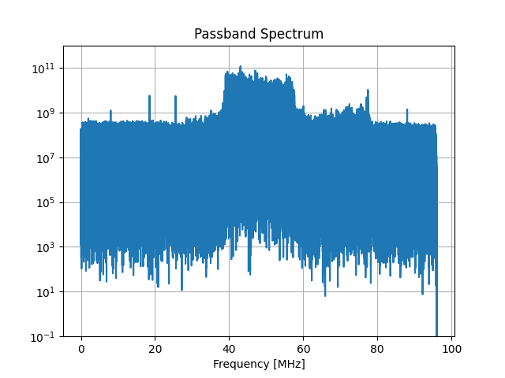
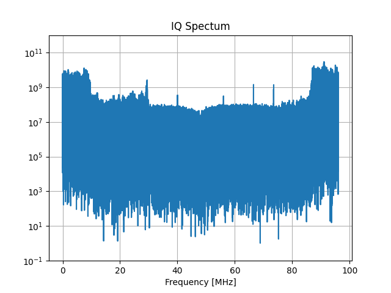

# ATA-RAW-to-IQ

This is a Python script which converts the ATA's beamformer output to an IQ timeseries.
The RAW files are read using Wael Farahs [guppi package](https://github.com/wfarah/guppi), which also provides information from header files, such as: 
1. Channel Bandwidth 
2. Total Bandwidth
3. Center Frequency (Header['OBSFREQ'] denotes the frequency at which the center channel starts. Therefore the center frequency can be calculated by adding half of the channels bandwidth)
4. Number of Samples per Spectrum
5. Time per Spectrum
6. Header Size

An example for a header is provided in Header_Example.md.

The IQ timesamples are generated by reading in a spectrum, and converting it to an IQ spectrum and then performing a FFT. The resulting time samples are then interleaved and saved to disc along with [sigmf](https://github.com/gnuradio/SigMF) metadata, which consists of the header of the original *.raw file as well as some additional information, such as the number of blocks which were processed, the total time these blocks amount to, the polarisation of the processed data, the saved data type, the resulting bandwidth and the frequency the data is centered around. This is repeated for the amount of blocks specified by the user.

The script uses command line inputs to hand user specific options to the script:

1. -i (required) Path to the input *.raw file
2. -o (required) Desired path and name of the output file (don't add a file type extention)
3. -decim Decimation factor used in a FIR Filter. A higher decimation factor reduces bandwidth, therefore data size and aliasing. Default = 1.
4. -fc Frequency which will be centered around DC after processing. Note that this expects a passband freqency. This means, that the input spectrum beginns at DC and ends at Header['OBSBW'] (in MHz) the center frequency has to be choosen from that interval. The center freqency is also limited by Header['CHAN_BW'], as it can only be a multiple of the bandwidth. Default = Header['OBSBW']/2
5. -X or -Y Pick the polarisation that should be converted. Default is X therefore this has only to be specified for Y polarisation.

# Example

This shall serve as an example on how to convert some data collected with the ATAs beamformer to IQ time samples.
The original RF spectrum is presented in the plot below.

This is data from a LTE cell tower which transmitts at a center frequency of 1960 MHz. As we can see, the spectrum is centered around the middle of the bandwidth. The center of the signal should end up at DC to process it further.
It is the default option to center the center of the original spectrum at DC and we do not want to decimate the signal. As these are the default options we do not have to pass any arguments to the script besides the paths for in- and output files.
The resulting spectrum is shown in the following plot.

As we can see the RF to IQ conversion consists of swapping the left half of the spectrum with the right half. This is due to the fact, that numpys IFFT function expects the first half of the spectrum to consist of the positive frequencies and the right half of the negative frequencies. In this case this is achieved by swapping the halves of the spectrum.