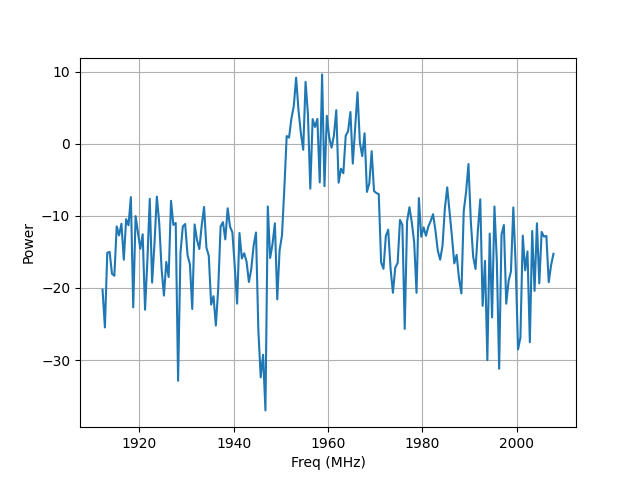

# ATA-RAW-to-IQ

This is a Python script which converts the ATA's beamformer output to an IQ timeseries.
The RAW files are read using Wael Farahs [guppi package](https://github.com/wfarah/guppi), which also provides information from header files, such as: 
1. Channel Bandwidth 
2. Total Bandwidth
3. Center Frequency
4. Number of Samples per Spectrum
5. Time per Spectrum
6. Header Size

an example for a header is provided in Header_Example.md.

The IQ timesamples are generated by reading in a spectrum, and converting it to an IQ spectrum and then performing a FFT. The resulting timesamples are then saved to disc. This is repeated for the amount of blocks specified by the user.

# Example